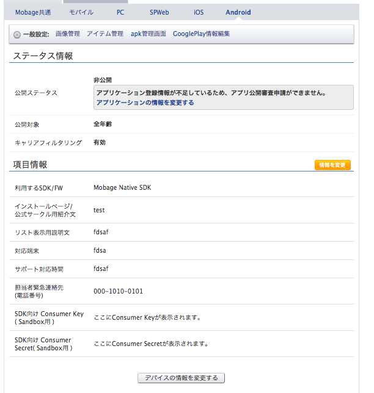

### Getting Started
- Mobage Native SDKのダウンロードと解凍
- プロジェクトのインポート  
当ディレクトリのHelloMobageと、解凍したNativeSDKのandroid/MobageNativeAndroidをeclipseにインポートする。
- EclipseでHelloMobageのプロジェクト設定を開き、設定画面にてLibraryにMobageNativeAndroidを追加する。  

- HelloMobage、MobageNativeAndroidが利用しているAndroidSDKのバージョンをインストール済みのものに変更。
- HelloMobageプロジェクト内のjavaソース、AndroidManifest.xml内の{app_id}をMobage Developers Japanのアプリケーション詳細ページのMobage共通ページに表示されているアプリIDで置換する。

- 同様に、{consumer_key},{consumer_sec ret}、Andoidタブに表示されているConsumer Key、Consumer Secretで置き換える。  （Service用ではなく、Sandbox用のConsumer Key,Consumer Secretですのでご注意ください）

